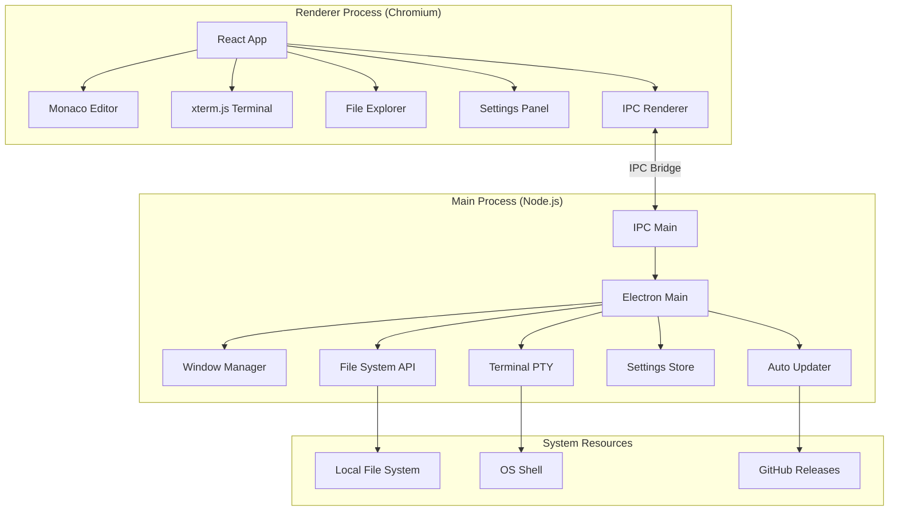

## Overview

Blink Code Editor is built on a modern Electron-based architecture, combining the power of Node.js with web technologies to deliver a fast, native desktop code editing experience.

## Tech Stack

<CardGroup cols={2}>
  <Card title="Electron" icon="atom">
    Cross-platform desktop framework (v30.0.1) providing native OS integration
  </Card>
  <Card title="React" icon="react">
    UI framework (v18.2.0) for building component-based interfaces
  </Card>
  <Card title="TypeScript" icon="code">
    Type-safe development with full IntelliSense support
  </Card>
  <Card title="Vite" icon="bolt">
    Lightning-fast build tool with HMR for development
  </Card>
  <Card title="Monaco Editor" icon="keyboard">
    VS Code's editor component providing rich code editing features
  </Card>
  <Card title="xterm.js" icon="terminal">
    Full-featured terminal emulator in the browser
  </Card>
</CardGroup>

## Project Structure

The codebase is organized into distinct layers for maintainability:

```
blink/
├── electron/              # Main process code
│   ├── main.ts           # App lifecycle & window management
│   └── preload.ts        # IPC bridge (context isolation)
├── src/                  # Renderer process (React app)
│   ├── components/       # React UI components
│   │   ├── Editor/      # Monaco editor integration
│   │   ├── Explorer/    # File tree sidebar
│   │   ├── Terminal/    # xterm.js terminal
│   │   ├── Navbar/      # Top navigation bar
│   │   ├── BottomBar/   # Status bar & diagnostics
│   │   └── Settings/    # Preferences panel
│   ├── views/           # Page-level components
│   ├── utils/           # Helper functions
│   └── App.tsx          # Root component
├── dist/                 # Vite build output (renderer)
├── dist-electron/        # Compiled Electron code (main)
└── package.json         # Dependencies & build scripts
```

<Note>
  The `electron/` directory contains Node.js code with full system access, while `src/` contains browser-safe React code that communicates via IPC.
</Note>

## Architecture Diagram



## Process Architecture

### Main Process (`electron/main.ts`)

The main process handles system-level operations and manages the application lifecycle:

```typescript
// electron/main.ts:157-173
function createWindow() {
    win = new BrowserWindow({
        width: 1280,
        height: 800,
        minWidth: 900,
        minHeight: 600,
        icon: path.join(process.env.VITE_PUBLIC, "logo.png"),
        webPreferences: {
            preload: path.join(__dirname, "preload.mjs"),
            devTools: !!VITE_DEV_SERVER_URL,
        },
        autoHideMenuBar: true,
        frame: false,
        maximizable: true,
        resizable: true,
    });
}
```

**Key Responsibilities:**
- Window creation and management (electron/main.ts:157)
- Custom window controls for frameless design (electron/main.ts:217-243)
- File system operations (electron/main.ts:246-354)
- Terminal PTY spawning with node-pty (electron/main.ts:388-426)
- Settings persistence (electron/main.ts:356-381)
- Auto-update orchestration (electron/main.ts:439-473)

### Renderer Process (`src/`)

The renderer process runs the React application in a sandboxed environment:

```typescript
// src/App.tsx
import { HashRouter } from "react-router-dom"
import Router from "./views/Router"
import { initGA, logPageView } from "./analytics/analytics"

function App() {
    useEffect(() => {
        initGA()
        logPageView()
    }, [])
    
    return (
        <HashRouter>
            <Router />
        </HashRouter>
    )
}
```

**Key Features:**
- React-based UI with HashRouter for navigation
- Monaco Editor integration for code editing
- xterm.js for terminal emulation
- IPC communication with main process

## IPC Communication

Blink uses Electron's IPC (Inter-Process Communication) to bridge the renderer and main processes securely:

<Tabs>
  <Tab title="File Operations">
```typescript
// Main Process Handler (electron/main.ts:317-324)
ipcMain.handle('file:read', async (_, filePath: string) => {
    try {
        return await fs.readFile(filePath, 'utf-8');
    } catch (error) {
        console.error('Failed to read file:', error);
        return null;
    }
});

// Renderer Process Call
const content = await window.electronAPI.invoke('file:read', filePath);
```
  </Tab>
  
  <Tab title="Terminal Communication">
```typescript
// Main Process: Create PTY (electron/main.ts:388-408)
ipcMain.handle('terminal:create', async (_, cwd?: string, shell?: string) => {
    const defaultShell = process.platform === 'win32' 
        ? 'powershell.exe' 
        : (process.env.SHELL || '/bin/bash');
    const id = `term_${++_terminalCounter}`;
    const term = pty.spawn(shellToUse, [], {
        name: 'xterm-color',
        cols: 80,
        rows: 24,
        cwd: cwd || process.env.HOME || '/',
        env: process.env as Record<string, string>,
    });
    terminals.set(id, term);
    // Stream data back to renderer
    term.onData((data) => {
        win?.webContents.send('terminal:data', id, data);
    });
    return id;
});

// Renderer Process: Listen for data (src/components/BottomBar/TerminalPanel.tsx:101-103)
window.electronAPI.on('terminal:data', (_, termId, data) => {
    if (termId === id) term.write(data);
});
```
  </Tab>
  
  <Tab title="Window Controls">
```typescript
// Main Process (electron/main.ts:217-243)
ipcMain.on("window-minimize", () => {
    win?.minimize();
});

ipcMain.on("window-maximize", () => {
    if (!win) return;
    if (win.isMaximized()) {
        win.unmaximize();
    } else {
        win.maximize();
    }
});

ipcMain.on("window-close", () => {
    win?.close();
});
```
  </Tab>
</Tabs>

<Tip>
  IPC handlers use `ipcMain.handle()` for request-response patterns and `ipcMain.on()` for one-way messages. The renderer uses `window.electronAPI.invoke()` and `window.electronAPI.send()` respectively.
</Tip>

## File System Architecture

Blink implements a lazy-loading file tree system for performance:

```typescript
// electron/main.ts:46-110
async function getFolderTree(dirPath: string, recursive: boolean = false) {
    const stats = await fs.stat(dirPath);
    const name = path.basename(dirPath);
    
    if (stats.isDirectory()) {
        const children = await fs.readdir(dirPath);
        let childrenNodes: any[] = [];
        
        if (recursive) {
            // Full tree expansion
            childrenNodes = await Promise.all(
                children
                    .filter(child => !EXCLUDED_DIRS.includes(child))
                    .map(child => getFolderTree(path.join(dirPath, child), true))
            );
        } else {
            // Shallow fetch: just metadata
            childrenNodes = await Promise.all(
                children.map(async (child) => {
                    const childPath = path.join(dirPath, child);
                    const childStats = await fs.stat(childPath);
                    return {
                        name: child,
                        type: childStats.isDirectory() ? 'folder' : 'file',
                        path: childPath,
                        hasChildren: childStats.isDirectory()
                    };
                })
            );
        }
        // Sort: folders first, then alphabetically
        return {
            name,
            type: 'folder',
            path: dirPath,
            children: childrenNodes.sort((a, b) => {
                if (a.type === b.type) return a.name.localeCompare(b.name);
                return a.type === 'folder' ? -1 : 1;
            })
        };
    }
}
```

**Excluded Directories** (electron/main.ts:44):
```typescript
const EXCLUDED_DIRS = ['.git', 'node_modules', 'dist', 'build', '.next', 'vendor', '.DS_Store'];
```

## Monaco Editor Integration

Blink synchronizes the workspace with Monaco's language services for IntelliSense:

```typescript
// src/components/Editor/Editor.tsx:68-79
useEffect(() => {
    if (monacoRef.current && tree && tree.path !== lastSyncedTreeRef.current) {
        syncWorkspaceWithMonaco(monacoRef.current, tree);
        
        // Setup compiler options for module resolution
        const syncDisposables = setupCompilerOptions(monacoRef.current, tree.path);
        disposablesRef.current.push(syncDisposables);
        
        lastSyncedTreeRef.current = tree.path;
    }
}, [tree, monacoRef.current]);
```

**Key Features:**
- Multi-model management for open tabs (Editor.tsx:49-64)
- TypeScript compiler options configuration
- Ctrl+Click navigation between files (Editor.tsx:119-131)
- Real-time validation and error markers (Editor.tsx:158-162)

## Terminal Architecture

The integrated terminal uses **node-pty** for native shell access and **xterm.js** for rendering:

```typescript
// src/components/BottomBar/TerminalPanel.tsx:95-99
window.electronAPI.invoke('terminal:create', cwd, shell).then((id: string) => {
    terminalIdRef.current = id;
    
    // Bidirectional streaming
    window.electronAPI.on('terminal:data', (_, termId, data) => {
        if (termId === id) term.write(data);
    });
    
    term.onData((data) => {
        window.electronAPI.send('terminal:input', id, data);
    });
});
```

**Features:**
- Automatic resize handling with FitAddon (TerminalPanel.tsx:23-34)
- Custom color theme matching editor (TerminalPanel.tsx:52-78)
- Process exit detection (TerminalPanel.tsx:104-106)

## Settings Persistence

Settings are stored as JSON in the user data directory:

```typescript
// electron/main.ts:357-377
const settingsPath = path.join(app.getPath('userData'), 'settings.json');

ipcMain.handle('settings:load', async () => {
    try {
        const data = await fs.readFile(settingsPath, 'utf-8');
        return JSON.parse(data);
    } catch (error) {
        return null; // File doesn't exist yet
    }
});

ipcMain.handle('settings:save', async (_, settingsObj: any) => {
    await fs.writeFile(settingsPath, JSON.stringify(settingsObj, null, 2), 'utf-8');
});
```

## Build Configuration

Vite handles both the renderer and Electron main process:

```typescript
// vite.config.ts:7-35
export default defineConfig({
  plugins: [
    react(),
    electron({
      main: {
        entry: 'electron/main.ts',
        vite: {
          build: {
            rollupOptions: {
              // node-pty must be external (native module)
              external: ['node-pty'],
            },
          },
        },
      },
      preload: {
        input: path.join(__dirname, 'electron/preload.ts'),
      },
      renderer: process.env.NODE_ENV === 'test' ? undefined : {},
    }),
  ],
});
```

<Note>
  The `node-pty` native module must remain external to the bundle since it contains platform-specific binaries.
</Note>

## Auto-Update System

Blink uses `electron-updater` for seamless updates:

```typescript
// electron/main.ts:10-16, 439-473
autoUpdater.logger = console;
autoUpdater.autoDownload = true;
autoUpdater.autoInstallOnAppQuit = true;

ipcMain.on('check-update', () => {
    autoUpdater.checkForUpdatesAndNotify();
});

autoUpdater.on('update-available', () => {
    win?.webContents.send('update_available');
});

autoUpdater.on('update-downloaded', () => {
    win?.webContents.send('update_downloaded');
});

ipcMain.on('restart_app', () => {
    autoUpdater.quitAndInstall();
});
```

## Performance Optimizations

<AccordionGroup>
  <Accordion title="Lazy File Tree Loading">
    Only loads immediate children of directories, expanding on demand to handle large workspaces efficiently (electron/main.ts:46-110).
  </Accordion>
  
  <Accordion title="Monaco Model Reuse">
    Reuses Monaco editor models across tab switches to preserve undo history and validation state (Editor.tsx:49-64).
  </Accordion>
  
  <Accordion title="Terminal Resize Debouncing">
    Uses ResizeObserver with FitAddon to efficiently handle window resizing without excessive PTY resize calls (TerminalPanel.tsx:136-137).
  </Accordion>
  
  <Accordion title="Vite HMR">
    Hot Module Replacement during development for instant feedback without full reloads.
  </Accordion>
</AccordionGroup>

## Security Model

- **Context Isolation**: Enabled by default, renderer cannot directly access Node.js APIs
- **Preload Script**: Exposes only whitelisted APIs via `contextBridge` (electron/preload.ts)
- **No `nodeIntegration`**: Renderer runs in a sandboxed Chromium environment
- **DevTools Disabled**: Production builds block DevTools shortcuts (electron/main.ts:196-208)

## Next Steps

<CardGroup cols={2}>
  <Card title="Components" icon="puzzle-piece" href="/developer/components">
    Explore the React component architecture
  </Card>
  <Card title="Building" icon="hammer" href="/developer/building">
    Learn how to build and package Blink
  </Card>
</CardGroup>