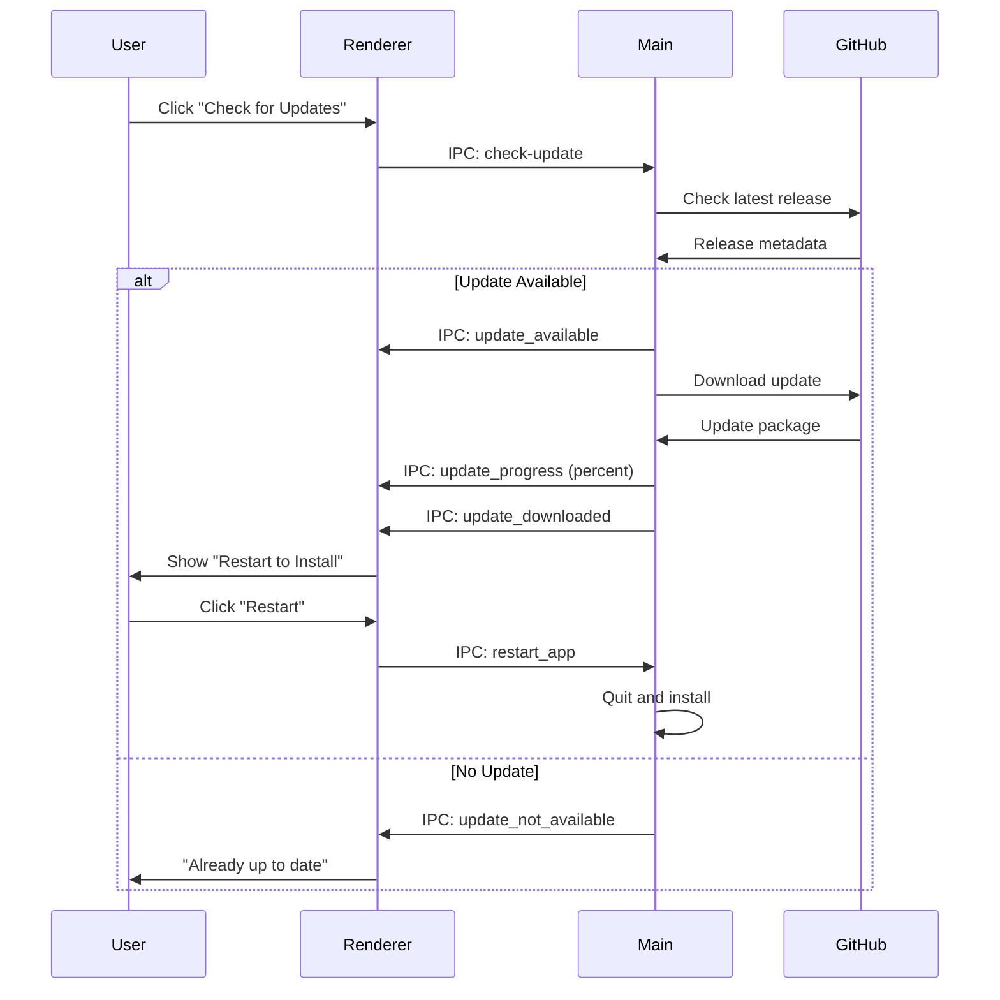

## Prerequisites

Before building Blink, ensure you have the following installed:

<CardGroup cols={2}>
  <Card title="Node.js" icon="node-js">
    Version 18.x or higher required for native module support
  </Card>
  <Card title="npm" icon="npm">
    Comes with Node.js, used for dependency management
  </Card>
  <Card title="Git" icon="git">
    For cloning the repository and version control
  </Card>
  <Card title="Build Tools" icon="wrench">
    Platform-specific tools for compiling native modules
  </Card>
</CardGroup>

### Platform-Specific Requirements

<Tabs>
  <Tab title="Windows">
    - **Visual Studio Build Tools**: Install from [visualstudio.microsoft.com](https://visualstudio.microsoft.com/downloads/)
    - **Python 3.x**: Required for node-gyp
    - **Windows SDK**: Included with Visual Studio Build Tools
    
    ```bash
    # Install with Chocolatey
    choco install visualstudio2022buildtools python
    ```
  </Tab>
  
  <Tab title="macOS">
    - **Xcode Command Line Tools**: Required for compilation
    
    ```bash
    xcode-select --install
    ```
  </Tab>
  
  <Tab title="Linux">
    - **build-essential**: GCC, Make, and other build tools
    - **libxtst-dev**: X11 testing library
    - **libpng-dev**: PNG library development files
    
    ```bash
    # Ubuntu/Debian
    sudo apt-get install build-essential libxtst-dev libpng-dev
    
    # Fedora/RHEL
    sudo dnf install @development-tools libXtst-devel libpng-devel
    ```
  </Tab>
</Tabs>

---

## Quick Start

<Steps>
  <Step title="Clone the Repository">
    ```bash
    git clone https://github.com/CodeAdiksuu/blink.git
    cd blink
    ```
  </Step>
  
  <Step title="Install Dependencies">
    This will install all npm packages including native modules:
    
    ```bash
    npm install
    ```
    
    <Note>
      The installation includes `node-pty`, a native module that requires compilation. This may take a few minutes.
    </Note>
  </Step>
  
  <Step title="Run Development Server">
    Start Vite dev server with hot module replacement:
    
    ```bash
    npm run dev
    ```
    
    The Electron window will open automatically with live reload enabled.
  </Step>
</Steps>

---

## Development Workflow

### Available Scripts

<CodeGroup>
```bash package.json
{
  "scripts": {
    "dev": "vite",
    "build": "tsc && vite build && electron-builder --win --linux",
    "lint": "eslint . --ext ts,tsx --report-unused-disable-directives --max-warnings 0",
    "preview": "vite preview"
  }
}
```
</CodeGroup>

| Script | Description |
|--------|-------------|
| `npm run dev` | Start development server with HMR |
| `npm run build` | Compile TypeScript, build renderer, and package for Windows/Linux |
| `npm run lint` | Run ESLint for code quality checks |
| `npm run preview` | Preview production build locally |

### Development Mode Details

When you run `npm run dev`, the following happens:

1. **Vite Dev Server** starts on `http://localhost:5173` (renderer process)
2. **vite-plugin-electron** compiles `electron/main.ts` and watches for changes
3. **Electron window** launches and loads from the dev server
4. **Hot Module Replacement** enables instant UI updates without restart

```typescript
// electron/main.ts:34
export const VITE_DEV_SERVER_URL = process.env["VITE_DEV_SERVER_URL"];

// electron/main.ts:210-215
if (VITE_DEV_SERVER_URL) {
    win.loadURL(VITE_DEV_SERVER_URL);
} else {
    win.loadFile(path.join(RENDERER_DIST, "index.html"));
}
```

<Tip>
  DevTools are automatically enabled in development mode and blocked in production builds.
</Tip>

---

## Build Process

### TypeScript Compilation

The build starts with TypeScript compilation:

```bash
tsc
```

This validates types and generates `.d.ts` files. Configuration:

```json tsconfig.json (excerpt)
{
  "compilerOptions": {
    "target": "ES2020",
    "module": "ESNext",
    "lib": ["ES2020", "DOM", "DOM.Iterable"],
    "jsx": "react-jsx",
    "strict": true,
    "moduleResolution": "bundler",
    "resolveJsonModule": true,
    "esModuleInterop": true,
    "skipLibCheck": true
  }
}
```

### Vite Build

Vite bundles the renderer and main processes:

```bash
vite build
```

**Output structure:**
```
dist/                  # Renderer process (React app)
├── index.html
├── assets/
│   ├── index-*.js
│   └── index-*.css
└── ...

dist-electron/         # Main process (Electron)
├── main.js
└── preload.mjs
```

<Accordion title="Vite Configuration Details">
```typescript
// vite.config.ts:7-50
export default defineConfig({
  plugins: [
    react(),
    electron({
      main: {
        entry: 'electron/main.ts',
        vite: {
          build: {
            rollupOptions: {
              // node-pty must stay external (native binary)
              external: ['node-pty'],
            },
          },
        },
      },
      preload: {
        input: path.join(__dirname, 'electron/preload.ts'),
      },
      renderer: process.env.NODE_ENV === 'test' ? undefined : {},
    }),
  ],
  css: {
    preprocessorOptions: {
      scss: {
        api: 'modern-compiler',
      },
    },
  },
  build: {
    rollupOptions: {
      external: ['node-pty'],
    },
  },
})
```
</Accordion>

### Electron Builder

Final step packages the application with `electron-builder`:

```bash
electron-builder --win --linux
```

---

## Packaging Configuration

### electron-builder Setup

Configuration is defined in `package.json`:

```json package.json (build config)
{
  "name": "blink",
  "version": "0.0.12",
  "description": "Blink Code Editor is a high-performance development environment built for speed and efficiency.",
  "author": "CodeAdiksuu",
  "main": "dist-electron/main.js",
  "build": {
    "appId": "com.blink.editor",
    "productName": "Blink",
    "files": [
      "dist/**/*",
      "dist-electron/**/*",
      "node_modules/**/*",
      "package.json"
    ],
    "directories": {
      "output": "release"
    },
    "win": {
      "target": ["nsis", "portable"],
      "icon": "public/logo.png"
    },
    "linux": {
      "target": ["AppImage", "deb", "rpm"],
      "icon": "public/logo.png",
      "category": "Development"
    },
    "mac": {
      "target": ["dmg", "zip"],
      "icon": "public/logo.png",
      "category": "public.app-category.developer-tools"
    }
  }
}
```

<Note>
  The `node_modules` directory is included because `node-pty` contains platform-specific native binaries that must be bundled.
</Note>

### Build Outputs

<Tabs>
  <Tab title="Windows">
    **Targets**: NSIS installer and portable executable
    
    ```
    release/
    ├── Blink Setup 0.0.12.exe         # NSIS installer
    └── Blink 0.0.12.exe               # Portable version
    ```
    
    **NSIS Installer Features:**
    - Per-user or system-wide installation
    - Desktop and Start Menu shortcuts
    - Uninstaller registration
    - Auto-update support
  </Tab>
  
  <Tab title="Linux">
    **Targets**: AppImage, DEB, and RPM packages
    
    ```
    release/
    ├── Blink-0.0.12.AppImage          # Universal Linux binary
    ├── blink_0.0.12_amd64.deb         # Debian/Ubuntu package
    └── blink-0.0.12.x86_64.rpm        # Fedora/RHEL package
    ```
    
    **AppImage Advantages:**
    - No installation required
    - Works on any Linux distribution
    - Sandboxed execution
  </Tab>
  
  <Tab title="macOS">
    **Targets**: DMG disk image and ZIP archive
    
    ```
    release/
    ├── Blink-0.0.12.dmg               # Drag-to-install disk image
    └── Blink-0.0.12-mac.zip           # Compressed app bundle
    ```
    
    **Note**: macOS builds require code signing for Gatekeeper. See [Apple Developer documentation](https://developer.apple.com/developer-id/).
  </Tab>
</Tabs>

---

## Platform-Specific Builds

### Build for Single Platform

<CodeGroup>
```bash Windows Only
npm run build -- --win
```

```bash Linux Only
npm run build -- --linux
```

```bash macOS Only
npm run build -- --mac
```
</CodeGroup>

### Build Specific Targets

<CodeGroup>
```bash Windows Portable Only
electron-builder --win portable
```

```bash Linux AppImage Only
electron-builder --linux AppImage
```

```bash macOS DMG Only
electron-builder --mac dmg
```
</CodeGroup>

---

## Debugging

### Main Process Debugging

Add `--inspect` flag to debug Electron's main process:

```json package.json
{
  "scripts": {
    "dev:debug": "vite --inspect"
  }
}
```

Then attach Chrome DevTools:
1. Open `chrome://inspect`
2. Click "Configure" and add `localhost:9229`
3. Your Electron process will appear under "Remote Target"

### Renderer Process Debugging

DevTools are enabled by default in development:

```typescript
// electron/main.ts:164-167
webPreferences: {
    preload: path.join(__dirname, "preload.mjs"),
    devTools: !!VITE_DEV_SERVER_URL,  // Auto-enabled in dev
}
```

Open with `Ctrl+Shift+I` or `Cmd+Option+I`.

### Production Debugging

Temporarily enable DevTools in production:

```typescript
// electron/main.ts:166
devTools: true  // Change from !!VITE_DEV_SERVER_URL
```

<Warning>
  Never ship production builds with DevTools enabled, as it exposes internal code and potential security vulnerabilities.
</Warning>

---

## Dependency Management

### Production Dependencies

These are bundled with the application:

```json package.json (excerpt)
{
  "dependencies": {
    "@aptabase/electron": "^0.3.1",      // Analytics
    "@fortawesome/fontawesome-svg-core": "^7.2.0",
    "@xterm/addon-fit": "^0.11.0",       // Terminal auto-sizing
    "@xterm/xterm": "^6.0.0",            // Terminal emulator
    "node-pty": "^1.1.0"                  // PTY for terminal
  }
}
```

<Note>
  `node-pty` is a **native module** that must be rebuilt for the target Electron version during installation.
</Note>

### Development Dependencies

Used only during development and building:

```json package.json (excerpt)
{
  "devDependencies": {
    "@monaco-editor/react": "^4.7.0",    // Code editor
    "@types/react": "^18.2.64",
    "@vitejs/plugin-react": "^4.2.1",
    "electron": "^30.0.1",
    "electron-builder": "^24.13.3",      // Packaging
    "electron-updater": "^6.8.3",        // Auto-updates
    "react": "^18.2.0",
    "react-dom": "^18.2.0",
    "react-router-dom": "^7.13.0",
    "sass": "^1.97.3",
    "typescript": "^5.2.2",
    "vite": "^5.1.6",
    "vite-plugin-electron": "^0.28.6"
  }
}
```

---

## Auto-Update System

### Configuration

Auto-updates are configured in the main process:

```typescript
// electron/main.ts:10-16
import { autoUpdater } from 'electron-updater';

autoUpdater.logger = {
  info: (message: any) => console.log(message),
  warn: (message: any) => console.warn(message),
  error: (message: any) => console.error(message)
};
autoUpdater.autoDownload = true;
autoUpdater.autoInstallOnAppQuit = true;
```

### Update Flow



### IPC Handlers

```typescript
// electron/main.ts:440-473
// User clicks "Check for Updates"
ipcMain.on('check-update', () => {
    autoUpdater.checkForUpdatesAndNotify();
});

// Update found
autoUpdater.on('update-available', () => {
    win?.webContents.send('update_available');
});

// No update found
autoUpdater.on('update-not-available', () => {
    win?.webContents.send('update_not_available');
});

// Download progress
autoUpdater.on('download-progress', (progress) => {
    win?.webContents.send('update_progress', progress.percent);
});

// Download complete
autoUpdater.on('update-downloaded', () => {
    win?.webContents.send('update_downloaded');
});

// User clicks "Restart and Install"
ipcMain.on('restart_app', () => {
    autoUpdater.quitAndInstall();
});
```

<Tip>
  electron-updater automatically fetches updates from GitHub Releases. Ensure your repository has proper release tags and assets.
</Tip>

---

## Troubleshooting

<AccordionGroup>
  <Accordion title="node-pty Build Failures">
    **Problem**: Native module compilation fails during `npm install`
    
    **Solutions:**
    - Ensure build tools are installed (see Prerequisites)
    - Clear npm cache: `npm cache clean --force`
    - Delete `node_modules` and reinstall: `rm -rf node_modules && npm install`
    - Check Node.js version: `node --version` (must be 18.x+)
  </Accordion>
  
  <Accordion title="Electron Window Doesn't Open">
    **Problem**: `npm run dev` runs but no window appears
    
    **Solutions:**
    - Check console for errors
    - Verify Vite dev server is running: `http://localhost:5173`
    - Kill orphaned Electron processes: `pkill -f electron`
    - Clear Electron cache: `rm -rf ~/.config/Electron/`
  </Accordion>
  
  <Accordion title="Build Output Missing Assets">
    **Problem**: Packaged app is missing images or fonts
    
    **Solutions:**
    - Ensure assets are in `public/` directory
    - Check `files` array in electron-builder config
    - Verify `VITE_PUBLIC` path resolution in main.ts:38-40
  </Accordion>
  
  <Accordion title="Module Not Found Errors">
    **Problem**: `Cannot find module 'monaco-editor'` or similar
    
    **Solutions:**
    - Ensure dependency is in correct section (dependencies vs devDependencies)
    - For renderer imports, check Vite externals config
    - For main process imports, check electron-builder externals
    - Reinstall: `npm install`
  </Accordion>
  
  <Accordion title="Terminal Not Working in Packaged App">
    **Problem**: Terminal blank or crashes in production build
    
    **Solutions:**
    - Verify `node-pty` is in `dependencies` (not devDependencies)
    - Ensure `node-pty` is marked as external in vite.config.ts:18
    - Check that `node_modules` is included in electron-builder files
    - Rebuild node-pty for correct Electron version: `npm rebuild node-pty --runtime=electron --target=30.0.1`
  </Accordion>
</AccordionGroup>

---

## CI/CD Pipeline

### GitHub Actions Example

```yaml .github/workflows/build.yml
name: Build and Release

on:
  push:
    tags:
      - 'v*'

jobs:
  build:
    strategy:
      matrix:
        os: [ubuntu-latest, windows-latest, macos-latest]
    
    runs-on: ${{ matrix.os }}
    
    steps:
      - uses: actions/checkout@v3
      
      - name: Setup Node.js
        uses: actions/setup-node@v3
        with:
          node-version: 18
      
      - name: Install dependencies
        run: npm install
      
      - name: Build
        run: npm run build
      
      - name: Upload artifacts
        uses: actions/upload-artifact@v3
        with:
          name: ${{ matrix.os }}-build
          path: release/*
      
      - name: Release
        uses: softprops/action-gh-release@v1
        if: startsWith(github.ref, 'refs/tags/')
        with:
          files: release/*
        env:
          GITHUB_TOKEN: ${{ secrets.GITHUB_TOKEN }}
```

---

## Performance Optimization

### Production Build Tips

1. **Tree Shaking**: Vite automatically removes unused code
2. **Minification**: Enable in `vite.config.ts`:
   ```typescript
   build: {
     minify: 'terser',
     terserOptions: {
       compress: { drop_console: true }
     }
   }
   ```
3. **Code Splitting**: Dynamic imports for large components:
   ```typescript
   const Settings = lazy(() => import('./components/Settings/Settings'));
   ```

### Bundle Size Analysis

```bash
npm install --save-dev rollup-plugin-visualizer
```

```typescript vite.config.ts
import { visualizer } from 'rollup-plugin-visualizer';

export default defineConfig({
  plugins: [
    react(),
    electron({ /* ... */ }),
    visualizer({ open: true })
  ]
});
```

Run `npm run build` to generate an interactive bundle visualization.

---

## Next Steps

<CardGroup cols={2}>
  <Card title="Architecture" icon="sitemap" href="/developer/architecture">
    Deep dive into Blink's technical architecture
  </Card>
  <Card title="Components" icon="puzzle-piece" href="/developer/components">
    Explore React component APIs
  </Card>
</CardGroup>