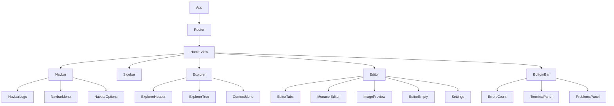

## Component Hierarchy

Blink's UI is built with React components organized in a hierarchical structure:



## Core Components

### Editor Component

The main code editing component integrating Monaco Editor.

**Location**: `src/components/Editor/Editor.tsx`

<Tabs>
  <Tab title="Interface">
```typescript
interface EditorProps {
    tabs: TabData[];
    activeTabIndex: number;
    setActiveTabIndex: (index: number) => void;
    onCloseTab: (index: number) => void;
    onContentChange: (newContent: string) => void;
    onCursorChange: (pos: { line: number, column: number }) => void;
    onValidationChange: (markers: any[]) => void;
    tree: TreeNode | null;
    openFolder: () => void;
    onOpenFile: (name: string, type: FileType, path: string) => void;
    // Settings props
    settings: EditorSettings;
    onSettingChange: (key: keyof EditorSettings, value: any) => void;
    isSettingsActive: boolean;
    showSettingsTab: boolean;
    onOpenSettings: () => void;
    onCloseSettings: () => void;
    onOpenSettingsFolder: () => void;
}
```
  </Tab>
  
  <Tab title="Usage Example">
```typescript
<Editor
    tabs={openTabs}
    activeTabIndex={activeIndex}
    setActiveTabIndex={setActiveIndex}
    onCloseTab={handleCloseTab}
    onContentChange={handleContentChange}
    onCursorChange={handleCursorChange}
    onValidationChange={handleValidationChange}
    tree={fileTree}
    openFolder={openFolderDialog}
    onOpenFile={handleOpenFile}
    settings={editorSettings}
    onSettingChange={updateSetting}
    isSettingsActive={isSettingsOpen}
    showSettingsTab={showSettings}
    onOpenSettings={openSettings}
    onCloseSettings={closeSettings}
    onOpenSettingsFolder={openSettingsFolder}
/>
```
  </Tab>
  
  <Tab title="Key Features">
**Monaco Integration**: Wraps `@monaco-editor/react` with custom lifecycle management (Editor.tsx:104-189)

**Multi-Model Support**: Manages multiple editor models for open tabs (Editor.tsx:49-64)

**Workspace Sync**: Synchronizes file tree with Monaco's IntelliSense (Editor.tsx:68-79)

**Image Preview**: Detects and renders image files (Editor.tsx:101-102)

**Settings Panel**: Toggles between editor and settings view (Editor.tsx:94-99)
  </Tab>
</Tabs>

<Note>
  The Editor component maintains Monaco models in memory to preserve undo history and validation state when switching tabs.
</Note>

#### Monaco Editor Configuration

```typescript
// src/components/Editor/Editor.tsx:166-188
options={{
    fontSize: settings.fontSize,
    minimap: { enabled: settings.minimap },
    scrollBeyondLastLine: settings.scrollBeyondLastLine,
    automaticLayout: true,
    fontFamily: settings.fontFamily,
    lineHeight: settings.lineHeight,
    padding: { top: 20 },
    wordBasedSuggestions: 'allDocuments',
    suggestOnTriggerCharacters: true,
    acceptSuggestionOnEnter: 'on',
    tabCompletion: 'on',
    links: true,
    renderValidationDecorations: 'on',
    tabSize: settings.tabSize,
    wordWrap: settings.wordWrap,
    lineNumbers: settings.lineNumbers,
    cursorStyle: settings.cursorStyle,
    cursorBlinking: settings.cursorBlinking,
    fontLigatures: settings.fontLigatures,
    renderWhitespace: settings.renderWhitespace,
    bracketPairColorization: { enabled: settings.bracketPairColorization },
}}
```

---

### Explorer Component

File tree sidebar with drag-and-drop support.

**Location**: `src/components/Explorer/Explorer.tsx`

<Tabs>
  <Tab title="Interface">
```typescript
interface ExplorerProps {
    onFileClick: (name: string, type: FileType, path: string) => void;
    tree: any;
    onNewFile: () => void;
    onNewFolder: () => void;
    selectedPath: string | null;
    onSelect: (path: string) => void;
    onExpand: (path: string) => void;
    onContextMenu: (e: React.MouseEvent, node: any) => void;
    onMove: (srcPath: string, targetPath: string) => void;
}
```
  </Tab>
  
  <Tab title="Implementation">
```typescript
// src/components/Explorer/Explorer.tsx:64-79
return (
    <div className="explorer" style={{ width: `${width}px` }}>
        <ExplorerHeader onNewFile={onNewFile} onNewFolder={onNewFolder} />
        <ExplorerTree 
            onFileClick={onFileClick} 
            externalTree={tree} 
            selectedPath={selectedPath}
            onSelect={onSelect}
            onExpand={onExpand}
            onContextMenu={onContextMenu}
            onMove={onMove}
        />
        <div className="explorer-resizer" onMouseDown={startResizing} />
    </div>
)
```
  </Tab>
  
  <Tab title="Features">
**Resizable Panel**: Drag-to-resize with min/max width constraints (Explorer.tsx:30-55)

**Lazy Loading**: Expands folders on demand via IPC

**Context Menu**: Right-click actions for file operations

**Drag and Drop**: Move files/folders within the tree
  </Tab>
</Tabs>

#### Resize Handling

```typescript
// src/components/Explorer/Explorer.tsx:47-54
const handleMouseMove = useCallback((e: MouseEvent) => {
    if (!isResizing.current) return;
    
    // Calculate new width based on sidebar offset (64px)
    const newWidth = e.clientX - 64; 
    if (newWidth > 150 && newWidth < 600) {
        setWidth(newWidth);
    }
}, []);
```

---

### TerminalPanel Component

Integrated terminal using xterm.js and node-pty.

**Location**: `src/components/BottomBar/TerminalPanel.tsx`

<Tabs>
  <Tab title="Interface">
```typescript
interface TerminalPanelProps {
    cwd?: string;
    profile?: TerminalProfile;
}

export interface TerminalPanelHandle {
    fit: () => void;
}

const TerminalPanel = forwardRef<TerminalPanelHandle, TerminalPanelProps>(
    ({ cwd, profile }, ref) => {
        // Component implementation
    }
);
```
  </Tab>
  
  <Tab title="Terminal Setup">
```typescript
// src/components/BottomBar/TerminalPanel.tsx:43-81
const term = new Terminal({
    cursorBlink: true,
    fontSize: 13,
    fontFamily: '"JetBrainsMono","Geist Mono", monospace',
    fontWeight: '500',
    letterSpacing: 1,
    allowProposedApi: true,
    theme: {
        background: '#17161a',
        foreground: '#f3f3f3',
        cursor: '#217DFF',
        cursorAccent: '#17161a',
        selectionBackground: 'rgba(33, 125, 255, 0.3)',
        // ANSI colors
        black: '#131313',
        red: '#ff0707',
        green: '#5cb85c',
        yellow: '#ffc107',
        blue: '#217DFF',
        magenta: '#1961c7',
        cyan: '#777777',
        white: '#b4b4b4',
    },
    allowTransparency: true,
    scrollback: 5000,
});

const fitAddon = new FitAddon();
term.loadAddon(fitAddon);
term.open(containerRef.current);
```
  </Tab>
  
  <Tab title="PTY Communication">
```typescript
// src/components/BottomBar/TerminalPanel.tsx:96-114
window.electronAPI.invoke('terminal:create', cwd, shell).then((id: string) => {
    terminalIdRef.current = id;

    // Stream PTY output → xterm
    const dataHandler = (_: any, termId: string, data: string) => {
        if (termId === id) term.write(data);
    };
    
    window.electronAPI.on('terminal:data', dataHandler);

    // Stream key input → PTY
    term.onData((data) => {
        window.electronAPI.send('terminal:input', id, data);
    });

    // Auto-resize
    const ro = new ResizeObserver(() => fit());
    ro.observe(containerRef.current);
});
```
  </Tab>
</Tabs>

<Tip>
  Use the `ref` handle to call `fit()` manually when the terminal panel is shown/hidden to ensure proper sizing.
</Tip>

---

### Settings Component

Preferences panel for editor customization.

**Location**: `src/components/Settings/Settings.tsx`

<Tabs>
  <Tab title="EditorSettings Interface">
```typescript
export interface EditorSettings {
    fontSize: number;
    fontFamily: string;
    lineHeight: number;
    tabSize: number;
    wordWrap: string;
    minimap: boolean;
    lineNumbers: string;
    cursorStyle: string;
    cursorBlinking: string;
    fontLigatures: boolean;
    scrollBeyondLastLine: boolean;
    renderWhitespace: string;
    bracketPairColorization: boolean;
}
```
  </Tab>
  
  <Tab title="Default Values">
```typescript
// src/components/Settings/Settings.tsx:72-86
export const DEFAULT_EDITOR_SETTINGS: EditorSettings = {
    fontSize: 14,
    fontFamily: 'Geist Mono, monospace',
    lineHeight: 24,
    tabSize: 4,
    wordWrap: 'off',
    minimap: false,
    lineNumbers: 'on',
    cursorStyle: 'line',
    cursorBlinking: 'blink',
    fontLigatures: true,
    scrollBeyondLastLine: false,
    renderWhitespace: 'none',
    bracketPairColorization: true,
};
```
  </Tab>
  
  <Tab title="Component Props">
```typescript
interface SettingsProps {
    settings: EditorSettings;
    onSettingChange: (key: keyof EditorSettings, value: any) => void;
    onOpenSettingsFolder: () => void;
}

export default function Settings({ 
    settings, 
    onSettingChange, 
    onOpenSettingsFolder 
}: SettingsProps) {
    // Settings panel implementation
}
```
  </Tab>
</Tabs>

#### Setting Types

```typescript
// src/components/Settings/Settings.tsx:8-34
type SettingType = 'number' | 'select' | 'toggle' | 'font';

interface SettingDefinition<T = string | number | boolean> {
    key: string;
    displayName: string;
    monacoProperty: string;
    description?: string;
    type: SettingType;
    value: T;
    options?: SelectOption[];  // For 'select' type
    min?: number;              // For 'number' type
    max?: number;
    step?: number;
}
```

---

### Navbar Component

Top navigation bar with window controls and menus.

**Location**: `src/components/Navbar/Navbar.tsx`

```typescript
// src/components/Navbar/Navbar.tsx:10-21
interface NavbarProps {
    onOpenSettings: () => void;
}

export default function Navbar({ onOpenSettings }: NavbarProps) {
    return (
        <nav>
            <div className="navbar_left">
                <NavbarLogo />
                <NavbarMenu onOpenSettings={onOpenSettings} />
            </div>
            <NavbarOptions />
        </nav>
    );
}
```

**Sub-components:**
- `NavbarLogo`: Application branding
- `NavbarMenu`: File, Edit, View, Help menus
- `NavbarOptions`: Window controls (minimize, maximize, close)

---

### BottomBar Component

Status bar showing diagnostics and file information.

**Location**: `src/components/BottomBar/BottomBar.tsx`

```typescript
// src/components/BottomBar/BottomBar.tsx:8-43
interface BottomBarProps {
    activeFile?: TabData;
    cursorPos: { line: number; column: number };
    errors: number;
    warnings: number;
    onToggleProblems: () => void;
}

export default function BottomBar({ 
    activeFile, 
    cursorPos, 
    errors, 
    warnings, 
    onToggleProblems 
}: BottomBarProps) {
    return (
        <div className="bottom_bar">
            <ErrorsCount 
                errors={errors} 
                warnings={warnings} 
                onClick={onToggleProblems} 
            />
            
            <div className="rightside">
                <div className="item">
                    Ln {cursorPos.line}, Col {cursorPos.column}
                </div>
                {activeFile && (
                    <>
                        <div className="item">UTF-8</div>
                        <div className="item language">
                            <FontAwesomeIcon icon={typeIconMap[activeFile.type]?.icon} />
                            <span>{getLanguageDisplayName(activeFile.name)}</span>
                        </div>
                    </>
                )}
            </div>
        </div>
    )
}
```

---

## Utility Components

### EditorTabs

Tab bar for managing open files.

**Location**: `src/components/Editor/EditorTabs.tsx`

**Features:**
- Close buttons with hover states
- Active tab highlighting
- Settings tab toggle
- File type icons

### ExplorerTree

Recursive tree component for file system.

**Location**: `src/components/Explorer/ExplorerTree.tsx`

**Features:**
- Expand/collapse folders
- File type icons with colors
- Selection highlighting
- Context menu integration

### ImagePreview

Renders image files in the editor area.

**Location**: `src/components/Editor/ImagePreview.tsx`

```typescript
interface ImagePreviewProps {
    path: string;
    name: string;
}
```

Displays images using a custom `blink-resource://` protocol handler.

### ErrorsCount

Diagnostics counter in the status bar.

**Location**: `src/components/BottomBar/ErrorsCount.tsx`

Shows error and warning counts from Monaco's validation.

---

## Component Communication Patterns

### Props Drilling

Blink uses props for parent-child communication:

```typescript
// Parent passes handlers down
<Editor
    onContentChange={handleContentChange}
    onCursorChange={handleCursorChange}
/>

// Child calls handlers on events
function Editor({ onContentChange, onCursorChange }: EditorProps) {
    // ...
    onChange={(value) => onContentChange(value || '')}
    // ...
}
```

### Ref Forwarding

TerminalPanel exposes imperative methods:

```typescript
const terminalRef = useRef<TerminalPanelHandle>(null);

// Call fit() when panel is shown
useEffect(() => {
    if (showTerminal) {
        terminalRef.current?.fit();
    }
}, [showTerminal]);

<TerminalPanel ref={terminalRef} cwd={workingDir} />
```

### IPC Bridge

Components access Electron APIs via `window.electronAPI`:

```typescript
// Read file
const content = await window.electronAPI.invoke('file:read', filePath);

// Save file
await window.electronAPI.invoke('file:save', filePath, content);

// Listen for events
window.electronAPI.on('window-maximized', () => {
    setIsMaximized(true);
});
```

---

## Styling System

Blink uses **SCSS modules** for component styling:

```scss
// src/components/Editor/_Editor.scss
.editor {
    display: flex;
    flex-direction: column;
    height: 100%;
    background: $bg;
    
    &_main {
        flex: 1;
        overflow: hidden;
    }
}
```

**Import pattern:**
```typescript
import './_Editor.scss';
```

---

## Type Definitions

### TabData

```typescript
export interface TabData {
    name: string;
    path: string;
    content: string;
    type: FileType;
    isModified?: boolean;
}
```

### TreeNode

```typescript
export interface TreeNode {
    name: string;
    path: string;
    type: 'folder' | FileType;
    children?: TreeNode[];
    hasChildren?: boolean;
}
```

### FileType

```typescript
export type FileType = 
    | 'js' | 'jsx' | 'ts' | 'tsx' 
    | 'json' | 'html' | 'css' | 'scss'
    | 'md' | 'txt' | 'png' | 'jpg'
    | 'file' // Generic fallback
```

---

## Next Steps

<CardGroup cols={2}>
  <Card title="Architecture" icon="sitemap" href="/developer/architecture">
    Understand the overall system design
  </Card>
  <Card title="Building" icon="hammer" href="/developer/building">
    Learn how to build and run Blink
  </Card>
</CardGroup>